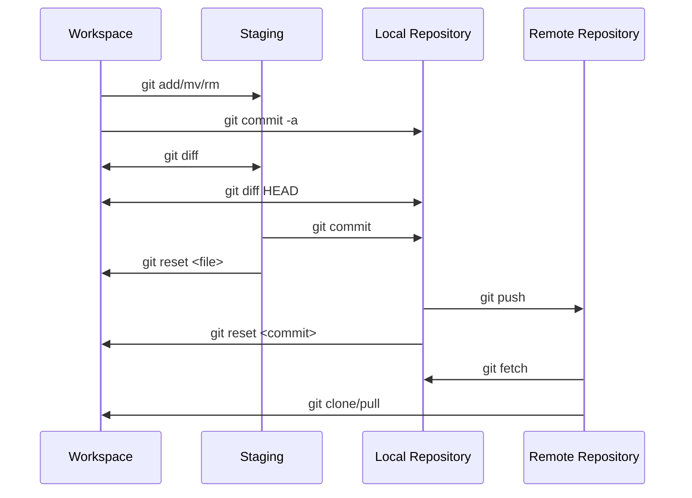
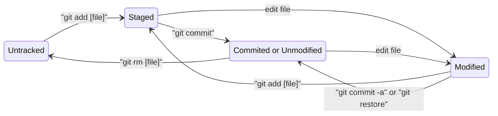

# Git e GitHub

## Como instalar e configurar o GIT no windows

- `git version`: exibe a versão do GIT
- `git config --global user.name {nome}`: altera o nome do usuário do GIT
  - Como, por exemplo, `git config --global user.name "xpto"`
  - Ao digitar o comando sem o input, é exibido no terminal o nome atual configurado
- `git config --global user.email {email}`: altera o email do usuário do GIT
  - Como, por exemplo, `git config --global user.email "xpto@email.com"`
  - Ao digitar o comando sem o input, é exibido no terminal o email atual configurado

## Comandos básicos (init, status, add, commit, log)

É no diretório `.git` que o GIT irá armazenar todas as informações relacionadas ao versionamento do seu projeto. Este diretório é criado no momento da criação do repositório. O diagrama abaixo mostra alguns comandos básicos do GIT para o gerenciamento do repositório.

Já o diagrama abaixo mostra como é o ciclo de vida dos arquivos em um repositório GIT. Todo arquivo novo adquire o status `UNTRACKED`. Após a adição a área de Stage, o status é alterado para `STAGED`. Qualquer edição no arquivo altera seu status para `MODIFIED`. Tanto um arquivo `STAGED` quanto `MODIFIED` passam para `COMMITED` (ou `UNMODIFIED`) após o uso da instrução `git commit`.

O comando `git log` exibe o histórico de commits dentro do repositório.
