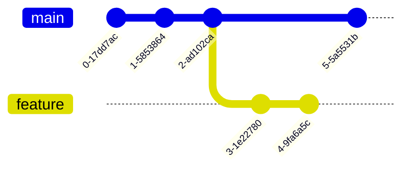

# Git e GitHub

## Como instalar e configurar o GIT no windows

- `git version`: exibe a versão do GIT
- `git config --global user.name {nome}`: altera o nome do usuário do GIT
  - Como, por exemplo, `git config --global user.name "xpto"`
  - Ao digitar o comando sem o input, é exibido no terminal o nome atual configurado
- `git config --global user.email {email}`: altera o email do usuário do GIT
  - Como, por exemplo, `git config --global user.email "xpto@email.com"`
  - Ao digitar o comando sem o input, é exibido no terminal o email atual configurado

## Comandos básicos (init, status, add, commit, log)

É no diretório `.git` que o GIT irá armazenar todas as informações relacionadas ao versionamento do seu projeto. Este diretório é criado no momento da criação do repositório. O diagrama abaixo mostra alguns comandos básicos do GIT para o gerenciamento do repositório.


Já o diagrama abaixo mostra como é o ciclo de vida dos arquivos em um repositório GIT. Todo arquivo novo adquire o status `UNTRACKED`. Após a adição a área de Stage, o status é alterado para `STAGED`. Qualquer edição no arquivo altera seu status para `MODIFIED`. Tanto um arquivo `STAGED` quanto `MODIFIED` passam para `COMMITED` (ou `UNMODIFIED`) após o uso da instrução `git commit`.


O comando `git log` exibe o histórico de commits dentro do repositório. Algumas variações incluem: `git log --graph`, `git log --pretty=oneline`.

## Rastreando e recuperando versões anteriores do projeto (checkout)

O `HEAD` - como no exemplo abaixo de uma saída do comando log - indica a versão atual do projeto. Ou seja, a versão atual do projeto é a `f5e0335`.

>
> **f5e0335** (**HEAD** -> **feature/git_github**) comandos básicos (init, status, add, commit, log)  
> **5e8579f** como instalar e configurar o git no windows  
> **e9a98d8** (**origin/main**, **origin/HEAD**, **main**) reestruturação do plano de estudo`  
> **c09888a** initial commit  
> **6614979** Initial commit
>

Ao realizar uma instrução como `git checkout [hash do commit]` o projeto restaura para a versão anterior. Por exemplo, ao realizar `git checkout 5e8579f`, todas as modificações serão restauradas para a versão indicada pelo hash. Essa restauração não é permanente, então, para retornar para a versão mais recente basta realizar um novo checkout para a branch desejada. Para restaurar de forma permanente algum commit, o comando `git restore --hard [hash do commit]` pode ser usado.

O comando `git diif` exibe as diferenças entre os arquivos atuais com os arquivos da versão apontada pelo `HEAD`.

## Criando ramificações do projeto (branch e merge) e resolução de conflitos

Para criar uma ramificação de uma branch, o comando `git checkout -b [nome da branch]` pode ser usado. Ele serve como um atalho para `git branch [nome da branch]` e `git checkout [nome da branch]`. Ramificações são úteis para trabalhar em modificações no código fonte do projeto sem alterar uma versão estável, por exemplo.  

Conflitos acontecem quando arquivos são modificados em duas branchs diferentes. Como existem duas versões do mesmo arquivo, o GIT acusa um conflito, sendo de responsabilidade do desenvolvedor realizar as alterações necessárias no arquivo para solucionar o conflito. O exemplo abaixo mostra um cenário de conflito. A branch `main` foi ramificada pela branch `feature` e qualquer arquivo que contenha modificações diferentes entre as branchs resultará em um conflito.



Os conflitos podem ser resolvidos realizando um merge entre as branchs. Por exemplo, no exemplo acima, o objetivo é fazer um merge da branch `feature` para a branch `main`, portanto, estando na `main`, o comando seria `git merge feature`. Os conflitos seriam marcados da seguinte forma:

```text
<<<<<<<< HEAD
System.out.println("olá mundo");
========
System.out.println("Acabou Chorare");
>>>>>>>> feature
```

Onde o texto abaixo de `HEAD` indica qual é o texto da branch atual e o texto abaixo de `=` indica qual é a modificação proveniente da outra branch. É possível apagar qual modificação deseja-se excluir ou, ainda, manter as duas modificações.  

Após realizado a solução do conflito, basta realizar um `git add` seguido de um `git commit`. Se for para abortar o merge, basta executar o comando `git merge --abort`.

## Enviando um projeto local para o GITHUB

Após criar um repositório no GITHUB e não marcar para inicializar com o README, o próprio GITHUB irá mostrar quais são os passos necessários para associar o repositório local com o repositório remoto. A sequência de comandos abaixo mostra quando o repositóro local não foi inicializado na máquina do usuário:

```text
git init
gut add README.md
git commit -m "first commit"
git remote add origin https://github.com/[user domain]/[repo name].git
git push -u origin main
```
