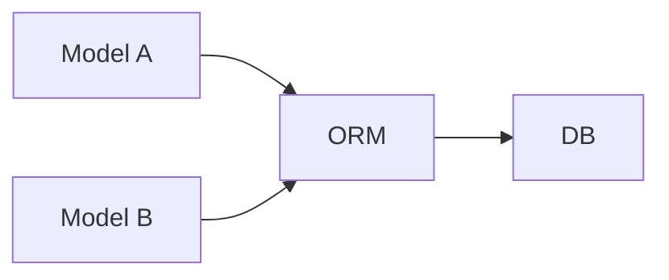
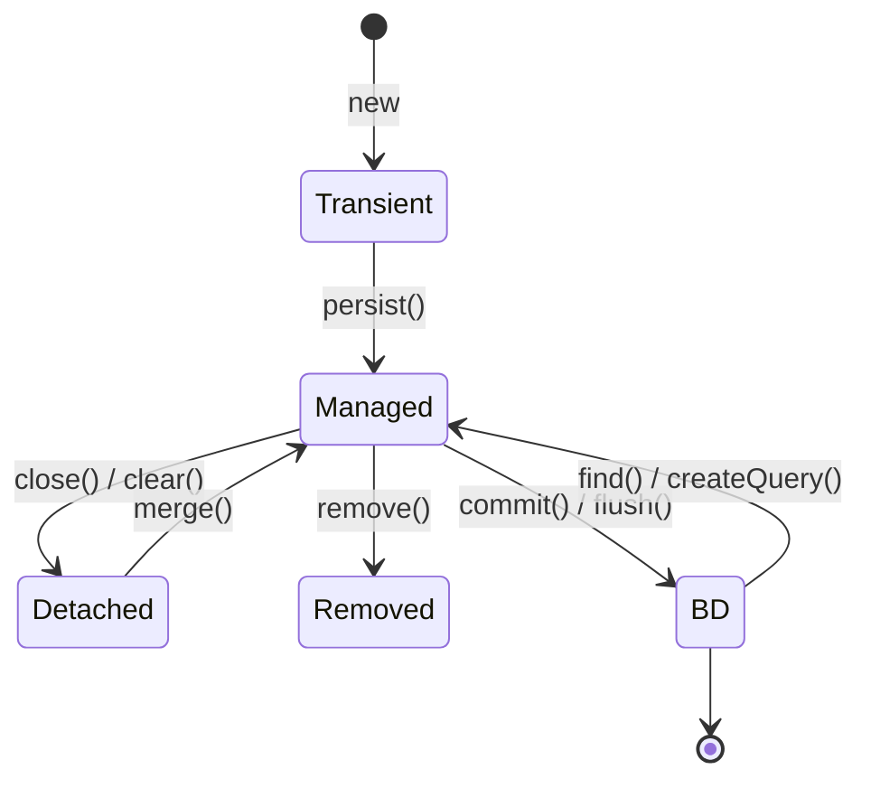

# JPA

## O que é ORM?

> ORM = Object Relational Mapping = Mapeamento Objeto Relacional

ORM não algum tipo de ferramenta ou tecnologia mas uma técnica ou conceito para manipulação de dados em bases relacionais. Surgiu na esteira da popularização do paradigma POO. O objetivo foi facilitar e flexibilizar a forma como os dados são manipulados em bases relacionais.  



Toda a camada de dados relacionais, Conexões e Querys que o desenvolvedor teria que implentar é abstraido por algum framework ORM. O foco passa a ser na declaração dos modelos de dados, ou seja, as classes e seus atributos que correspondem às tabelas e suas colunas em uma base relacional. Apesar disso, é possível declarar explicitamente querys com os frameworks. Cria uma ponte entre linuagen POO e bases de dados relacionais. Faz isso estabelendo associações:

- Tabela <-> Classe
- Colunas <-> Atributos

Além disso, faz parte de um ORM operações básicas do tipo **C**reate, **R**ead, **U**pdate e **D**elete.

## Frameworks ORM para Java

- Hibernate
- ActiveJPA
- Cayenne
- Ebean

## Qual é a vantagem de utilizar um ORM?

- **Produtividade**:
- **Padronização**: os frameworks ORM
- **Segurança**: os frameworks de ORM adicionam proteções extras, como a prevenção de SQL Injection.
- **Portabilidade**: o código escrito com o auxílio de um ORM para uma base de dados pode ser facilmente migrada para outra.

## Quais são as desvantagens ao utilizar um ORM?

- **Desempenho**: Para bases e modelos complexos, o desempenho pode ser prejudicado.
- **Curva de Aprendizado**: Aprender como operar um framework ORM é mais dispensioso que aprender a operar com SQL.
- **Dependência da Abstração**: Pode gerar uma certa dependência do framework

---

## O que é JPA?

JPA, sigla para Java Persistence API, é uma especificação que orienta como os frameworks de persistência Java devem ser implementados. Surgiu como uma necessidade de padronizar os diferentes tipos de ORM que estavam surgindo na época. A JPA foi impulsionada pelo Hibernate. EplipseLink é um framework de referência, ou seja, é um dos primeiros a implentar alguma especificação nova da API Java Persistence

JPA é como uma classe abstrada ou uma interface que necessita que seus métodos sejam implementados pelo utilizador.

O JPA é também especifica anotações para fazer alguns mapeamentos, como:

- **@Entity**: Indica que os objetos da classe dessa anotações podem ser persistidos.
- **@Table**: Faz o mapeamento da classe com a tabela pelo nome dessa última.
- **@Column**: Faz o mapeamento entre um atributo e uma coluna.
- **@Id**: Indica que o atributo da classe é a chave primária da tabela.

O JPA necessita de um arquivo de configuração especificando qual o banco, o usuário, a senha e outras propriedades. Este arquivo é o **persistence.xml** e pode ser parecido com o exemplo abaixo:

```xml
  <!-- persistence.xml -->
  <persistence-unit name="Banco_A" transaction-type="JTA">
    <provider>org.hibernate.ejb.HibernatePersistence</provider>

    <class>com.jpa.model.ClasseA</class>

    <properties>
      <property name="javax.persistence.jdbc.driver" value="org.hsqldb.jdbcDriver"/>
      <property name="javax.persistence.jdbc.url" value="jdbc:hsqldb:mem:hibernate"/>
      <property name="javax.persistence.jdbc.user" value="sa"/>
      <property name="javax.persistence.jdbc.password" value="senha"/>
    </persistence>
  </persistence-unit>
```

Um detalhe importante dessa configuração é a propriedade `transaction-type` da `persistence-unit`. O valor `JTA` indica que o gerenciamento das transações será delegada para um servidor. Portanto, é necessário que a utilização de um servidor como Jboss ou Glassfish. O valor `RESOURCE_LOCAL` indica que o gerenciamento das transações serão realizadas localmente pelo usuário.

É possível controlar ter um controle manual das transações, como:

```java
  public class Jpa {
    private static EntityManagerFactory emf = Persistence.createEntityManagerFactory("Banco_A");

    public static void main(String[] args) throws Exception {
      EntityManager entityManager = emf.createEntityManager();
      try {
        entityManager.getTransaction().begin();
        // ...
        entityManager.getTransaction().commit();
      } catch (Exception e) {
        if (entityManager.isOpen())
          entityManager.getTransaction().rollback();
      } finally {
        if (entityManager.isOpen())
          entityManager.close();
      }
    }
  }
```

A outra forma de controlar é delegando sua atribuição a um servidor, como Jboss, Glassfish. Esses servidores fazem uso da **Injeção de Dependência** para e de um EJB, como no exemplo abaixo:

```Java
  @Stateless
  public class ClasseJPA() {
    @PersistenceContext
    private EntityManager entityManager;
  }
```

Há também a possibilidade de utilizar um framework como o Spring e Hibernate.

## Ciclo de Vida das Entidades JPA



- **Transient**: O objeto foi instânciado, porém não foi reportado para o EntityManager. Assim, esse último desconhece essa entidade.
- **Managed**: Quando a entidade foi passada para o EntityManager. Ele irá conseguir persistir e gerenciar a entidade na base de dados.
- **Detached**: A entidade é conhecida pelo EntityManager pois já foi genrenciada por ele, entretanto, não está sendo mais. Qualquer alteração realizado no objeto da entidade não será refletida no banco.

> Para fazer o `merge()` é necessário que as entidades tenham explicitamente um construtor `default`, como:
>
> ```java
> public Produto(){}
> ```
>
> Além disso, este método não atualiza para `Managed` a instância passada em ``em.merge(produto)``. Ele irá devolver uma referência para um novo objeto que está sendo gerenciado. Logo, o código correto é ``produto = em.merge(produto)``.

## Relacionamentos

Por padrão, a JPA não assume qualquer tipo de cardinalidade entre as entidades. Portanto, é obrigatório especificar qual o tipo de relacionamento as tabelas irão assumir. Para isso, é possível utilizar as tags:

- `@JoinTable`: Capaz de configurar um relacionamento entre entidades especificando qual a tabela, as colunas e etc.
- `@ManyToOne`: Cria um relacionamento **Muitos para Um** entre as entidades.
- `@ManyToMany`: Cria um relacionamento **Muitos para Muitos** entre as entidades.
- `@OneToMany`: Cria um relacionamento **Um para Muitos** entre as entidades.
  - Existe um parâmetro chamado `cascade` que serve para propagar as operações realizadas em uma entidade para seus relacionamentos.
- `@OneToOne`: Cria um relacionemnto **Um para Um** entre as entidades.

## JPQL

É um mecanismo de busca similar ao SQL para JPA. A intenção é simplificar consultas às bases de dados. Uma instrução em SQL para recuperar todos os elementos da tabela `produto` seria:

> ``SELECT * FROM produto``

Enquanto que para JPQL a instrução fica:

> ``SELECT p FROM Produto p``

Onde `Produto` é o nome da classe mapeada como uma entidade do banco de dados.

É possível realizar consultas com filtros - similiar ao WHERE do SQL - e com Joins. Suponha que uma tabela `produto` (mapeada na classe `Produto`) tenha um relacionamento com a tabela `categoria` (mapeada na classe `Categoria`). A consulta ficaria:

> ``SELECT p FROM Produto p WHERE p.Categoria.nome = :nome``

Onde `:nome` é um argumento nomeado que será substituído posteriormente por um valor. Caso seja necessário especificar qual coluna deve ser retornada, pode-se fazer:

> ``SELECT p.nome FROM Produto p WHERE p.Categoria.nome = :nome``

### named query

---

## DAO
